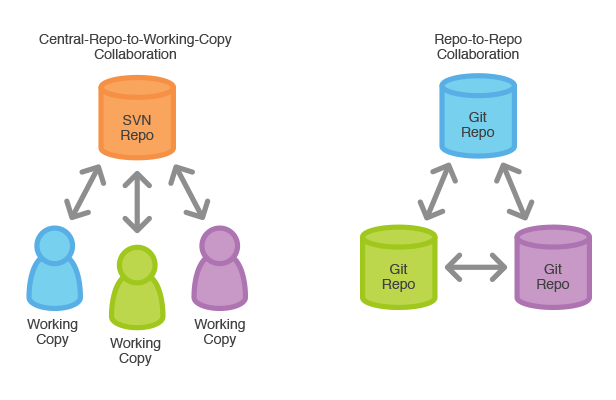

# Git과 Github 사용법

---
 

# Introduction to Git and Github

- What is Git?
- What is Github?
- Key differences between Git and Github
- Benefits of using Git and Github

<!-- Presenter's script: 

"Hello everyone, in this presentation, we will be discussing the basics of Git and Github. We will start by understanding what Git and Github are and then explore their key features and benefits. Let's get started!" 

-->

 

---

 

# Setting up Git

- Installing Git
- Configuring Git
- Setting up SSH keys

<!-- Presenter's script: 

"Now that we have a basic understanding of Git and Github, let's move on to setting up Git on our local machine. We will cover the installation process, configuring Git, and setting up SSH keys for secure communication with Github." 

-->

 
---

# Git 기초

---

# SVN vs GIT
  

---

 
# Basic Git commands

- `git init`

- `git add`

- `git commit`

- `git status`

- `git log`

- `git diff`

 

<!-- Presenter's script: 

"With Git installed and configured, it's time to learn some basic Git commands. We will cover commands like `git init` to initialize a new repository, `git add` to stage changes, `git commit` to save changes, `git status` to check the status of the repository, `git log` to view commit history, and `git diff` to see the differences between commits." 

-->

 

---

 

# Creating a new repository

 

- Creating a repository on Github

- Initializing a local repository

- Linking the local and remote repositories

 

<!-- Presenter's script: 

"Now that we know the basic Git commands, let's learn how to create a new repository. We will cover creating a repository on Github, initializing a local repository, and linking the local and remote repositories for seamless collaboration." 

-->

 

---

 

# Cloning a repository

 

- Cloning a repository from Github

- Cloning a repository using SSH or HTTPS

 

<!-- Presenter's script: 

"In this slide, we will learn how to clone an existing repository from Github. We will cover cloning a repository using both SSH and HTTPS protocols, and discuss the advantages of each method." 

-->

 

---

 

# Making changes and committing

 

- Making changes to files

- Staging and committing changes

- Writing meaningful commit messages

 

<!-- Presenter's script: 

"Now that we have a repository set up and cloned, let's explore how to make changes to files and commit those changes. We will cover staging and committing changes, as well as the importance of writing meaningful commit messages." 

-->

 

---

 

# Branching and merging

 

- Creating and switching branches

- Merging branches

- Handling merge conflicts

 

<!-- Presenter's script: 

"Branching and merging are essential concepts in Git. In this slide, we will learn how to create and switch branches, merge branches, and handle merge conflicts that may arise during the merging process." 

-->

 

---

 

# Collaborating on Github

 

- Forking a repository

- Making pull requests

- Reviewing and merging pull requests

 

<!-- Presenter's script: 

"Github provides a platform for collaborative development. In this slide, we will cover forking a repository, making pull requests to contribute changes, and the process of reviewing and merging pull requests." 

-->

 

---

 

# Pull requests

 

- Creating a pull request

- Adding comments and suggestions

- Resolving feedback

 

<!-- Presenter's script: 

"Pull requests are a crucial part of the collaborative workflow on Github. In this slide, we will learn how to create a pull request, add comments and suggestions to the code, and resolve feedback received during the review process." 

-->

 

---

 

# Resolving conflicts

 

- Understanding merge conflicts

- Resolving conflicts manually

- Using Git tools to resolve conflicts

 

<!-- Presenter's script: 

"Merge conflicts can occur when merging branches with conflicting changes. In this slide, we will understand what merge conflicts are, learn how to resolve conflicts manually, and explore Git tools that can help us in the conflict resolution process." 

-->

 

---

 

# Best practices for using Git and Github

 

- Keeping commits small and focused

- Using descriptive commit messages

- Regularly pulling changes from the remote repository

- Collaborating effectively with team members

 

<!-- Presenter's script: 

"To wrap up our presentation, let's discuss some best practices for using Git and Github. We will cover keeping commits small and focused, using descriptive commit messages, regularly pulling changes from the remote repository, and collaborating effectively with team members." 

-->

 

---

 

# Thank you!

 

<!-- Presenter's script: 

"Thank you for attending this presentation on Git and Github usage. We hope you found it informative and gained a better understanding of how to use Git and Github effectively. If you have any questions, feel free to ask." 

-->